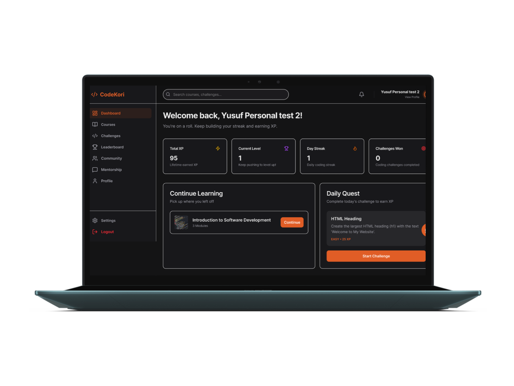
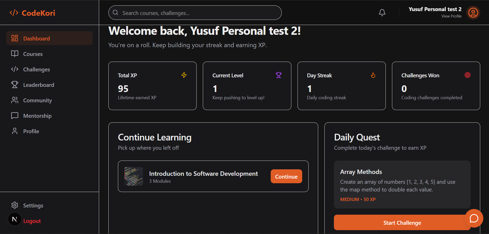

# CodeKori 

**CodeKori** is a full-stack learning platform made to empower university students through structured courses, interactive coding challenges, and a vibrant community. A platform with a focus on gamified progression, CodeKori delivers a great educational experience.

[](https://github.com/yusufmolumo/CodeKori)
[](https://drive.google.com/file/d/1WaVCgXYFCRrm6LsQVaRwhPKfD8nLTv75/view?usp=sharing)

---

## ✨ Features

- 📚 **Structured Learning Path**: 30+ lessons across HTML, CSS, and JavaScript.
- 💻 **Interactive Coding Challenges**: Integrated code editor with real-time feedback and hints.
- 🏆 **Gamified Progression**: Earn XP, level up, and maintain daily streaks to stay motivated.
- 💬 **Community Forum**: Discuss concepts, share solutions, and get help from fellow learners.
- 🔔 **Real-time Notifications**: Stay updated with new community posts and platform alerts.
- 🔍 **Global Search**: Find courses and challenges instantly with an intelligent search system.
- 🛡️ **Great UI/UX**: Professional dark-mode aesthetic with smooth animations and responsive design.

---

## 🎨 Design & Architecture

Visual designs and architecture diagrams can be found in the `designs/` folder.

| Asset | Description |
| :--- | :--- |
|  | **Figma Mockups**: High-fidelity wireframes and UI designs. |
|  | **Platform UI**: Screenshots of the dashboard and interactive components. |

---

## 🛠️ Tech Stack

- **Frontend**: Next.js, React, Tailwind CSS, Lucide React, Shadcn UI.
- **Backend**: Node.js, Express, Socket.io, Prisma ORM.
- **Database**: CockroachDB (PostgreSQL compatible).
- **Communication**: NodeMailer, Cloudinary (Image Hosting).

---

## 🚀 Getting Started

### Prerequisites

- Node.js (v18 or higher)
- npm or yarn
- A CockroachDB instance

### Installation & Setup

1. **Clone the repository**:
   ```bash
   git clone https://github.com/your-username/codekori.git
   cd codekori
   ```

2. **Backend Setup**:
   ```bash
   cd backend
   npm install
   ```
   Create a `.env` file in the `backend/` directory:
   ```env
   DATABASE_URL=your_cockroachdb_url
   JWT_SECRET=your_secret_key
   SMTP_HOST=smtp.gmail.com
   SMTP_PORT=587
   SMTP_USER=your_email
   SMTP_PASS=your_app_password
   FROM_EMAIL=your_email
   CLOUDINARY_CLOUD_NAME=your_cloudinary_cloud_name
   CLOUDINARY_API_KEY=your_cloudinary_api_key
   CLOUDINARY_API_SECRET=your_cloudinary_api_secret
   FRONTEND_URL=http://localhost:3000
   ```
   Initialize the database:
   ```bash
   npx prisma generate
   npx prisma db push
   npx prisma db seed
   ```
   Start the dev server:
   ```bash
   npm run dev
   ```

3. **Frontend Setup**:
   ```bash
   cd ../frontend
   npm install
   ```
   Create a `.env.local` file in the `frontend/` directory:
   ```env
   NEXT_PUBLIC_API_URL=http://localhost:5000/api
   ```
   Start the dev server:
   ```bash
   npm run dev
   ```

---

## 🚢 Deployment Plan

CodeKori is designed for scalable cloud deployment.

### Recommended Environment
- **Web App frontend**: Vercel.
- **API Server backend**: Render.
- **Database**: CockroachDB Dedicated/Serverless.
- **Media**: Cloudinary for user avatars and thumbnails.

### CI/CD Workflow
1. **Linting & Type-checking**: Ensure all code passes `npm run lint` and `tsc`.
2. **Build**: Generate production bundles using `npm run build`.
3. **Migrate**: Run Prisma migrations on the production database.
4. **Deploy**: Push to `main` branch to trigger automatic builds on Vercel/Render.

---

## 📄 License

This project is licensed under the MIT License.
