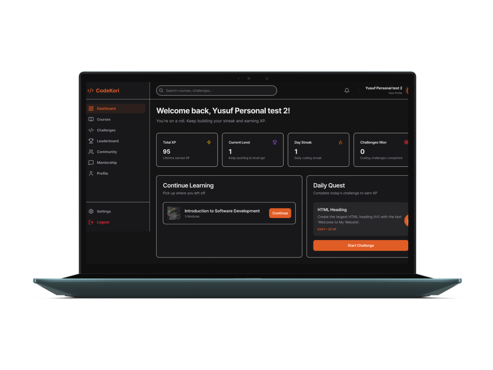
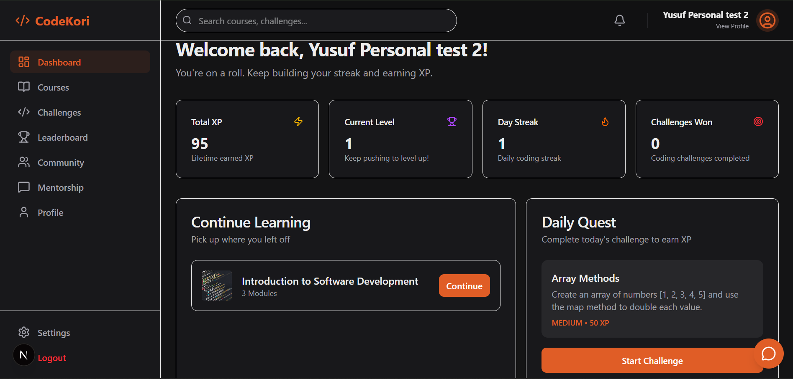

# CodeKori 

**CodeKori** is a full-stack gamified coding education platform built to empower university students through structured courses, interactive coding challenges, mentorship, and a vibrant community. With XP-based progression, daily streaks, leaderboards, and real-time notifications, CodeKori delivers an engaging learning experience.

- **GitHub Repository**: <a href="https://github.com/yusufmolumo/CodeKori" target="_blank">https://github.com/yusufmolumo/CodeKori</a>
- **Video Demo**: <a href="https://drive.google.com/file/d/1PPOIajpK0zetM-Vdy-sITlVEEE-Nsk1_/view?usp=sharing" target="_blank">https://drive.google.com/file/d/1PPOIajpK0zetM-Vdy-sITlVEEE-Nsk1_/view?usp=sharing</a>
- **Deployed App (Frontend)**: <a href="https://codekori.vercel.app" target="_blank">https://codekori.vercel.app</a>
- **Deployed API (Backend)**: <a href="https://codekori-api.onrender.com" target="_blank">https://codekori-api.onrender.com</a>

> **Note**: The backend is hosted on Render's free tier. It may take 30–60 seconds to wake up on first load. Please visit the [health check endpoint](https://codekori-api.onrender.com/health) first to warm it up before using the app.

---

## Features

### Learning & Courses
- **Structured Learning Paths** — 30+ lessons across HTML, CSS, and JavaScript with modular course structure.
- **Lesson Progress Tracking** — Mark lessons as complete, earn XP, and track progress per course.
- **Course Enrollment** — Enroll in courses and resume where you left off.
- **Enrollment & Completion Notifications** — Receive email + in-app alerts on enrollment and lesson completion.

### Coding Challenges
- **Interactive Code Editor** — Integrated editor with real-time feedback, hints, and test-case validation.
- **Difficulty Levels** — Challenges ranging from beginner to advanced.
- **Code Validation** — Submitted code is validated against test cases; incorrect or empty submissions are flagged as wrong.
- **Mentor-Created Challenges** — Mentors can create and manage custom challenges for learners.

### Skill Lab (Gamification Hub)
- **Interactive Quizzes** — Multiple-choice questions testing coding knowledge with answer validation.
- **Code Puzzles** — Hands-on coding exercises with automated correctness checking.
- **Daily Quests** — Daily challenges that refresh and reward XP for completion.
- **Answer Validation** — All quiz answers and code submissions are validated before marking as correct.
- **XP Rewards** — Earn XP for each correctly answered question or solved puzzle.

### Gamification & Progression
- **XP System** — Earn XP for completing lessons, challenges, skill lab activities, and community participation.
- **Leveling** — Automatic level progression based on accumulated XP.
- **Daily Streaks** — Maintain consecutive day streaks to stay motivated.
- **Leaderboard** — Compete with fellow learners on a global leaderboard.

### Mentorship System
- **Mentor Discovery** — Learners can browse available mentors and send connection requests.
- **Request Management** — Mentors can accept or decline mentee requests.
- **Connected Mentor View** — Learners see their active mentor with a "Connected" badge.
- **Private Chat** — Real-time 1-on-1 messaging between mentors and mentees.
- **Mentee Management** — Mentors can remove mentees with confirmation dialog and automatic notification.
- **Unread Message Badges** — Red badges on sidebar and individual chat buttons showing unread message counts.
- **Mentor Dashboard** — Mentors get mentee stats including courses enrolled, challenges completed, and XP.

### Community Forum
- **Discussion Board** — Create and browse posts, share solutions, and ask questions.
- **Categories** — Organized forum categories for different topics.
- **Comments & Likes** — Engage with posts through comments and reactions.
- **New Post Notifications** — All users are notified when new posts are shared.

## Design & Architecture

Visual designs and architecture diagrams can be found in the `designs/` folder.

| Asset | Description |
| :--- | :--- |
|  | **Figma Mockups**: High-fidelity wireframes and UI designs. |
|  | **Platform UI**: Screenshots of the dashboard and interactive components. |

---

## Tech Stack

| Layer | Technologies |
|-------|-------------|
| **Frontend** | Next.js 16, React, Tailwind CSS, Shadcn UI, Lucide React, Sonner (toasts), next-themes |
| **Backend** | Node.js, Express 5, TypeScript, Socket.io |
| **Database** | CockroachDB (PostgreSQL-compatible), Prisma ORM |
| **Email** | NodeMailer (Gmail SMTP) |
| **Media** | Cloudinary (image hosting) |
| **Auth** | JWT (access + refresh tokens), bcrypt |

---

## Project Structure

```
codekori/
├── backend/
│   ├── prisma/              # Database schema & seed data
│   ├── src/
│   │   ├── controllers/     # Route handlers (12 controllers)
│   │   ├── routes/           # Express route definitions
│   │   ├── services/         # Business logic services
│   │   │   ├── emailService.ts         # Email notifications (NodeMailer)
│   │   │   ├── gamificationService.ts  # XP, levels, streaks
│   │   │   ├── cloudinaryService.ts    # Image uploads
│   │   │   └── socketService.ts        # Real-time websockets
│   │   ├── middleware/       # Auth & authorization middleware
│   │   ├── config/           # Prisma client config
│   │   └── utils/            # Utility helpers
│   └── .env                  # Environment variables
├── frontend/
│   ├── src/
│   │   ├── app/
│   │   │   ├── dashboard/
│   │   │   │   ├── page.tsx              # Main dashboard
│   │   │   │   ├── courses/              # Course listing & details
│   │   │   │   ├── challenges/           # Coding challenges
│   │   │   │   ├── mentorship/           # Mentorship + chat
│   │   │   │   ├── community/            # Forum
│   │   │   │   ├── leaderboard/          # Rankings
│   │   │   │   ├── skill-lab/            # Gamification hub
│   │   │   │   ├── settings/             # User settings
│   │   │   │   ├── profile/              # User profile
│   │   │   │   ├── mentor-home/          # Mentor dashboard
│   │   │   │   ├── mentor-courses/       # Mentor course management
│   │   │   │   └── mentor-challenges/    # Mentor challenge management
│   │   │   └── layout.tsx
│   │   ├── components/
│   │   │   ├── layout/       # Sidebar, Header
│   │   │   ├── ui/           # Shadcn UI components
│   │   │   ├── theme-provider.tsx    # Theme context
│   │   │   └── toaster-provider.tsx  # Toast notifications
│   │   ├── context/          # Socket context
│   │   └── lib/              # API client, utilities
│   └── .env.local            # Frontend environment variables
├── testing/
│   ├── screenshots/          # 30 testing screenshots
│   └── TESTING_RESULTS.md    # Testing report
└── designs/                  # Figma mockups & screenshots
```

---

## Getting Started

### Prerequisites

- Node.js (v18 or higher)
- npm or yarn
- A CockroachDB instance (or any PostgreSQL-compatible database)

### Installation & Setup

1. **Clone the repository**:
   ```bash
   git clone https://github.com/yusufmolumo/CodeKori.git
   cd CodeKori
   ```

2. **Backend Setup**:
   ```bash
   cd backend
   npm install
   ```
   Create a `.env` file in the `backend/` directory:
   ```env
   # Database
   DATABASE_URL=your_cockroachdb_url

   # JWT
   JWT_SECRET=your_jwt_secret
   JWT_REFRESH_SECRET=your_jwt_refresh_secret

   # Email (Gmail SMTP)
   SMTP_HOST=smtp.gmail.com
   SMTP_PORT=587
   SMTP_USER=your_email@gmail.com
   SMTP_PASS=your_gmail_app_password
   FROM_EMAIL=your_email@gmail.com

   # Cloudinary
   CLOUDINARY_CLOUD_NAME=your_cloud_name
   CLOUDINARY_API_KEY=your_api_key
   CLOUDINARY_API_SECRET=your_api_secret

   # Server
   FRONTEND_URL=http://localhost:3000
   PORT=5000
   NODE_ENV=development
   ```

   Initialize the database:
   ```bash
   npx prisma generate
   npx prisma db push
   npx prisma db seed
   ```

   Start the dev server:
   ```bash
   npm run dev
   ```

3. **Frontend Setup**:
   ```bash
   cd ../frontend
   npm install
   ```
   Create a `.env.local` file in the `frontend/` directory:
   ```env
   NEXT_PUBLIC_API_URL=http://localhost:5000/api
   ```

   Start the dev server:
   ```bash
   npm run dev
   ```

4. **Access the app** at `http://localhost:3000`

---

## Testing

Comprehensive testing results are documented in [`testing/TESTING_RESULTS.md`](./testing/TESTING_RESULTS.md) with 30 screenshots covering:

| Testing Strategy | # Tests | Description |
|------------------|---------|-------------|
| **API/Integration** | 6 | Direct HTTP requests testing endpoints, validation, auth |
| **UI/Functional** | 12 | End-to-end feature testing across all modules |
| **Cross-Browser** | 2 | Chrome + Firefox/Edge compatibility |
| **Cross-Device** | 3 | Desktop, tablet, mobile responsive testing |
| **Performance** | 2 | Lighthouse audit + network timing analysis |

### Key Test Results
- **Lighthouse Scores**: Performance 70, Accessibility 84, Best Practices 96, SEO 100
- **API Response Times**: < 200ms average on localhost
- **Cross-Browser**: Fully functional on Chrome, Firefox, and Edge
- **Responsive Design**: Tested on desktop (1920×1080), tablet (iPad Air), and mobile (iPhone 14)

---

## API Overview

| Module | Endpoints | Description |
|--------|-----------|-------------|
| **Auth** | `POST /register`, `POST /login`, `PUT /change-password`, `POST /reset-password` | Registration, login, password management |
| **Courses** | `GET /courses`, `POST /courses/:id/enroll`, `POST /courses/lessons/:id/complete` | Course listing, enrollment, progress |
| **Challenges** | `GET /challenges`, `POST /challenges/:id/submit` | Coding challenges with test-case validation |
| **Skill Lab** | `GET /skill-lab`, `POST /skill-lab/:id/submit` | Gamification hub activities |
| **Mentorship** | `POST /mentorship/request`, `GET /mentorship/my-mentor`, `GET /mentorship/mentees`, `DELETE /mentorship/mentees/:id` | Mentor connections, management |
| **Chat** | `GET /mentorship/chat/:userId`, `POST /mentorship/chat/:userId` | Private messaging |
| **Forum** | `GET /forum/posts`, `POST /forum/posts`, `POST /forum/posts/:id/comments` | Community discussion |
| **Notifications** | `GET /notifications`, `POST /notifications/:id/read` | Alerts, unread counts |
| **Search** | `GET /search?q=` | Global search |
| **Users** | `GET /users/profile`, `PUT /users/profile` | Profile management |
| **Leaderboard** | `GET /gamification/leaderboard` | XP rankings |
| **Admin** | `GET /admin/users` | User management (admin only) |

---

## Deployment

### Production Environment

| Component | Platform | URL |
|-----------|----------|-----|
| **Frontend** | Vercel | [codekori.vercel.app](https://codekori.vercel.app) |
| **Backend API** | Render | [codekori-api.onrender.com](https://codekori-api.onrender.com) |
| **Database** | CockroachDB Cloud | Serverless cluster |
| **Media Storage** | Cloudinary | CDN |

### Deployment Steps

**Backend (Render):**
1. Create a new Web Service on [Render](https://render.com)
2. Connect GitHub repository, set root directory to `backend`
3. Build command: `npm install --include=dev && npx prisma generate && npm run build`
4. Start command: `npm run start`
5. Add all environment variables (DATABASE_URL, JWT_SECRET, SMTP credentials, etc.)

**Frontend (Vercel):**
1. Import project on [Vercel](https://vercel.com)
2. Set root directory to `frontend`
3. Add environment variable: `NEXT_PUBLIC_API_URL=https://codekori-api.onrender.com/api`
4. Deploy — Vercel auto-detects Next.js and builds

**Deployment Verification:**
- Backend health: `GET /health` returns `{"status":"ok"}`
- Frontend loads at Vercel URL with full functionality
- Cross-tested on Chrome, Firefox, and mobile browsers

---

## License

This project is licensed under the MIT License.
