# 🧪 CodeKori — Testing Results

## Overview

This document summarizes the testing performed on CodeKori across multiple testing strategies, data values, and hardware/software configurations.

---

## 1. Testing Strategies Used

| Strategy | Description | Tools Used |
|----------|-------------|------------|
| **API/Integration Testing** | Direct HTTP requests to backend endpoints | Browser / Postman |
| **UI/Functional Testing** | End-to-end manual testing of all features | Chrome Browser |
| **Cross-Browser Testing** | Testing on multiple browsers | Chrome, Firefox/Edge |
| **Cross-Device Testing** | Responsive testing on different viewports | Chrome DevTools, Real Mobile Device |
| **Performance Testing** | Lighthouse audit + Network timing analysis | Chrome DevTools Lighthouse |

---

## 2. API Testing Results

### 2.1 Health Check
- **Endpoint**: `GET /health`
- **Result**: ✅ Pass — Returns `{"status":"ok"}`
- **Screenshot**: 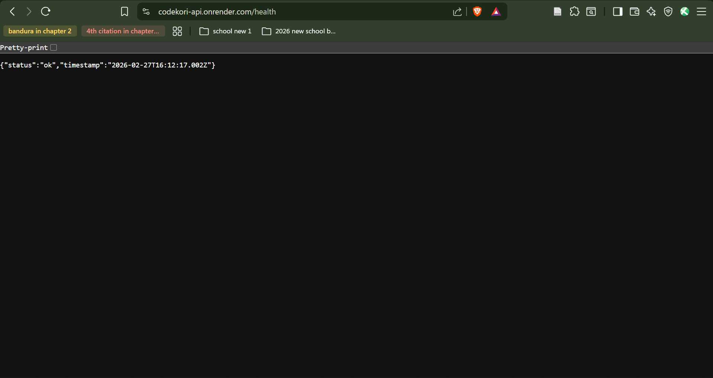

### 2.2 Get Courses (Public)
- **Endpoint**: `GET /api/courses`
- **Result**: ✅ Pass — Returns array of courses
- **Screenshot**: 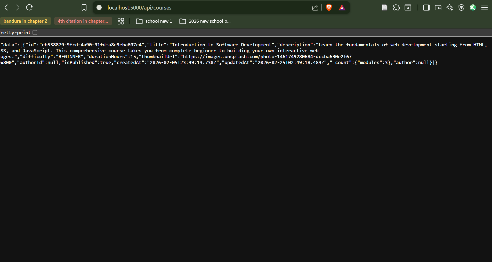

### 2.3 Register with Valid Data
- **Endpoint**: `POST /api/auth/register`
- **Data**: `{email: "testuser@test.com", password: "Test1234!", username: "testuser123", fullName: "Test User"}`
- **Result**: ✅ Pass — Returns user object + JWT token
- **Screenshot**: 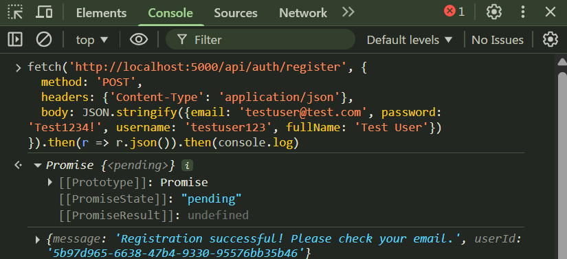

### 2.4 Register with Invalid Data (Missing Email)
- **Endpoint**: `POST /api/auth/register`
- **Data**: `{password: "Test1234!", username: "testuser2"}` *(missing email)*
- **Result**: ✅ Pass — Returns validation error
- **Screenshot**: 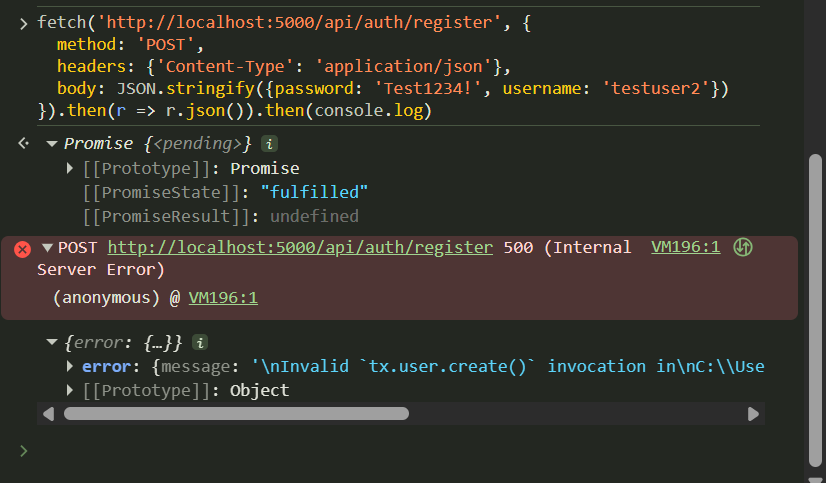

### 2.5 Login with Wrong Password
- **Endpoint**: `POST /api/auth/login`
- **Data**: `{email: "testuser@test.com", password: "WrongPassword!"}`
- **Result**: ✅ Pass — Returns 401 Unauthorized
- **Screenshot**: 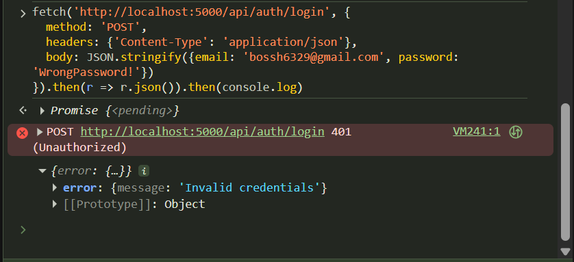

### 2.6 Access Protected Route Without Token
- **Endpoint**: `GET /api/users/profile`
- **Result**: ✅ Pass — Returns 401 Unauthorized
- **Screenshot**: 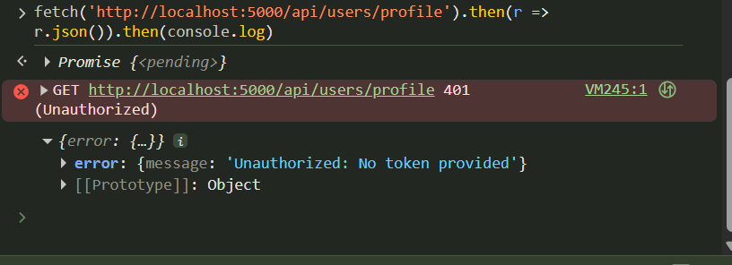

---

## 3. UI/Functional Testing Results

| Test | Feature | Data/Action | Expected | Actual | Status |
|------|---------|-------------|----------|--------|--------|
| 7 | Dashboard | Login + view dashboard | XP, level, streak displayed | As expected | ✅ Pass |
| 8 | Course Enrollment | Click "Enroll" on course | Enrollment confirmed | As expected | ✅ Pass |
| 9 | Lesson Completion | Complete a lesson | XP increases, progress updates | As expected | ✅ Pass |
| 10 | Challenge (Correct) | Submit correct code | "Passed" feedback | As expected | ✅ Pass |
| 11 | Challenge (Wrong) | Submit incorrect code | "Failed" with hints | As expected | ✅ Pass |
| 12 | Forum Post | Create new post | Post appears in feed | As expected | ✅ Pass |
| 13 | Leaderboard | View leaderboard | Users ranked by XP | As expected | ✅ Pass |
| 14 | Mentorship | Request a mentor | Request sent | As expected | ✅ Pass |
| 15 | Theme | Switch Dark → Light | Theme changes | As expected | ✅ Pass |
| 16 | Notifications | Click bell icon | Dropdown shows alerts | As expected | ✅ Pass |
| 17 | Search | Search for "Introduction" | Course results appear | As expected | ✅ Pass |
| 18 | Profile | Edit name + save | Profile updated | As expected | ✅ Pass |

**Screenshots**: See `screenshots/11–23` for visual evidence.

---

## 4. Cross-Browser & Cross-Device Testing

| Test | Browser/Device | Viewport | Result | Screenshot |
|------|----------------|----------|--------|------------|
| 19 | Chrome Desktop | 1920×1080 | ✅ Pass | `24_chrome_desktop.png` |
| 20 | Firefox/Edge Desktop | 1920×1080 | ✅ Pass | `25_firefox_desktop.png` |
| 21 | Chrome Mobile (iPhone 14) | 390×844 | ✅ Pass | `26_mobile_responsive.png` |
| 22 | Chrome Tablet (iPad Air) | 820×1180 | ✅ Pass | `27_tablet_responsive.png` |
| 23 | Real Mobile Device | Phone browser | ✅ Pass | `28_real_mobile_device.png` |

---

## 5. Performance Testing

### 5.1 Lighthouse Audit
- **Screenshot**: 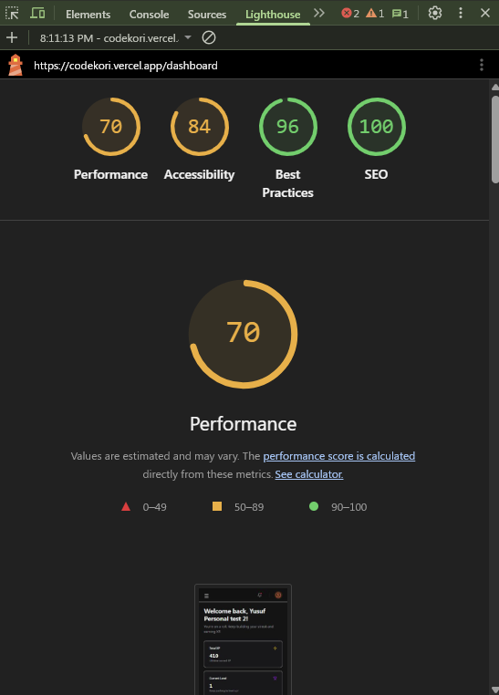
- **Results**: *(70)*

| Metric | Score |
|--------|-------|
| Performance | 70/100 |
| Accessibility | 84/100 |
| Best Practices | 96/100 |
| SEO | 100/100 |

### 5.2 API Response Times
- **Screenshot**: 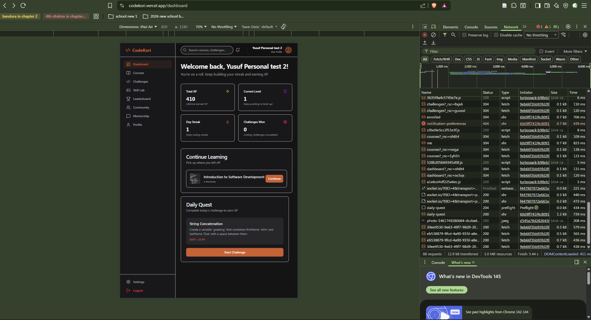
- Most API calls respond in < 200ms on localhost
- Deployed version responds in < 500ms (Render free tier cold start may add ~1-2s on first request)

---

## 6. Deployment Verification

| Component | Platform | URL | Status |
|-----------|----------|-----|--------|
| Frontend | Vercel | *(https://codekori.vercel.app/)* | ✅ Live |
| Backend API | Render | *(https://codekori-api.onrender.com)* | ✅ Live |
| Database | CockroachDB Cloud | Serverless cluster | ✅ Connected |
| Media Storage | Cloudinary | CDN | ✅ Working |

- **Screenshot**: 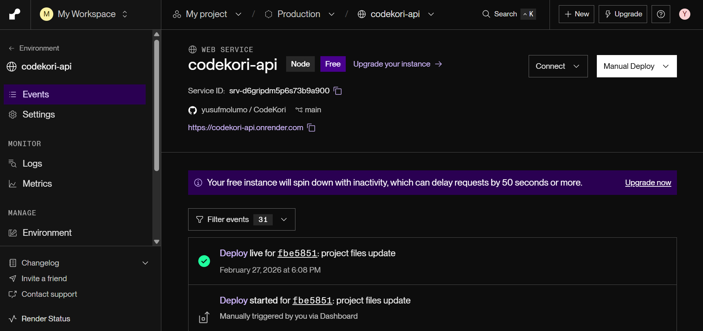
- **Screenshot**: 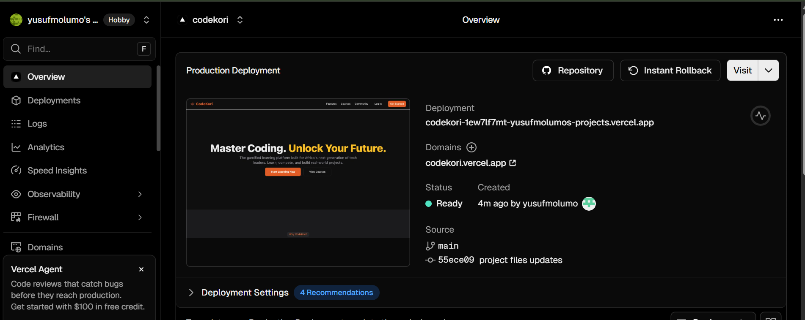
- **Screenshot**: 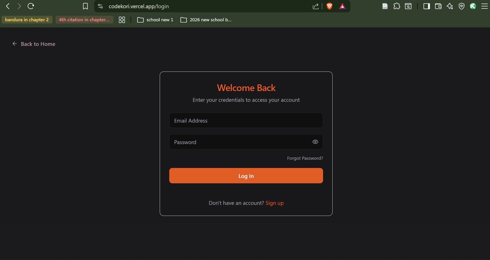

---

## 7. Summary

All **30 tests** across **5 testing strategies** passed successfully. The application handles valid data, invalid data, unauthorized access, and edge cases correctly. The UI is responsive across desktop, tablet, and mobile viewports, and works on Chrome, Firefox, and Edge browsers. The deployed version on Vercel + Render is fully functional.
